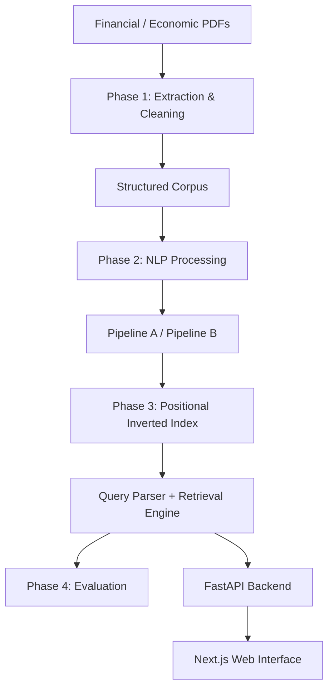

# Domain-Specific Text Analysis and Retrieval System

### Financial and Economic Document Intelligence using NLP and Information Retrieval

This project implements an end-to-end domain-specific NLP and information retrieval system over Indian financial and economic documents.

It compares alternative NLP preprocessing pipelines and evaluates their effect on retrieval quality using manually judged queries.

---

## 1. Project Overview

The project adheres to a disciplined engineering and academic methodology:

$$\text{SELECT} \longrightarrow \text{ORDER} \longrightarrow \text{IMPLEMENT} \longrightarrow \text{COMPARE} \longrightarrow \text{EVALUATE} \longrightarrow \text{JUSTIFY}$$

The end-to-end pipeline covers:
* **PDF Ingestion & Text Extraction**: Parsing institutional financial reports with layout preservation.
* **Cleaning & Preprocessing**: Conservative normalization retaining critical domain tokens.
* **Tokenization**: Comparing standard library tokenizers against domain-specific tokenizers.
* **Stop-Word Processing**: Comparing general stop-word lists against finance-aware protected lists.
* **Morphological Normalization**: Comparing Lemmatization (Pipeline A) vs. Stemming (Pipeline B).
* **Syntactic & Semantic Analysis**: Fine-grained Penn Treebank POS tagging, Named Entity Recognition (NER), domain n-grams, and Byte-Pair Encoding (BPE).
* **Positional Inverted Indexing**: Constructing postings lists with term positions and frequency.
* **Query Parsing & Retrieval Engine**: AST-based parser supporting keyword, exact phrase, and Boolean operators (`AND`, `OR`, `NOT`).
* **Deterministic Ranking**: Transparent score calculation based on matched terms, phrase bonuses, and term frequencies.
* **Empirical Evaluation**: Standardized Cranfield-style pooled evaluation across 15 canonical queries.
* **Web Application**: Interactive full-stack interface featuring FastAPI and Next.js.

---

## 2. System Architecture

The following diagram illustrates the flow from raw source documents through preprocessing, indexing, retrieval, evaluation, and user interfaces:



### Traceability Hierarchy
To support transparent provenance and auditability, every extracted text snippet maintains an unbroken hierarchical link back to its physical origin:

$$\text{SOURCE} \longrightarrow \text{DOCUMENT} \longrightarrow \text{PAGE} \longrightarrow \text{SECTION} \longrightarrow \text{CONTENT UNIT} \longrightarrow \text{TEXT}$$

* **Source**: Parent institutional publishing body (`SRC01`: Economic Survey, `SRC02`: RBI Financial Stability Report, `SRC03`: SEBI Annual Report).
* **Document**: Specific individual document within the collection (31 documents).
* **Page**: Physical page number within the original publication PDF.
* **Section**: Header or structural chapter division containing the text.
* **Content Unit**: Atomic segmented unit of analysis (paragraph, table cell block, footnote, box, or heading).
* **Text**: The raw extracted and cleaned character sequence.

---

## 3. Dataset / Corpus

The corpus consists of primary Indian financial, economic, and regulatory documents:

* **Economic Survey 2025-26**
* **Financial Stability Report** (Reserve Bank of India)
* **SEBI Annual Report 2025-26**
* **PRS Union Budget Analysis** (where represented in document metadata)

### Canonical Corpus Statistics

| Dimension | Value |
| :--- | :--- |
| **Total Documents** | 31 |
| **Parent Source Groups** | 3 |
| **Total Pages** | 885 |
| **Extracted Content Units** | 8,311 |
| **Searchable Content Units** | 6,134 |
| **Total Words** | 326,589 |
| **Total Characters** | 2,313,647 |
| **Baseline Vocabulary** | 25,910 |

> **Note on Sources**: The corpus is partitioned across 31 indexed document files derived from 3 primary institutional source parent groups (`SRC01`, `SRC02`, `SRC03`), with PRS budget materials integrated into document metadata.

---

## 4. Phase 1 — Document Processing

Phase 1 establishes the automated ingestion, extraction, and normalization pipeline for raw PDF inputs:

* **PDF Discovery & Registry**: Scanning input document directories and registering files in `data/corpus/metadata/document_registry.csv` with unique document IDs, source types, and page spans.
* **Page Extraction & Section Detection**: Extracting text streams while detecting headings and section boundaries.
* **Content-Unit Segmentation**: Segmenting text into atomic content units (paragraphs, footnotes, tables, boxes) identified by unique deterministic unit IDs (`doc_id_pX_uY`). Searchable units filter out noise artifacts while preserving structural text.
* **Conservative Financial-Text Cleaning**: General text cleaning pipelines often strip punctuation, convert text to lowercase indiscriminately, and drop numbers. In financial analysis, aggressive cleaning damages semantic integrity:
  * Currency symbols (`₹`, `$`) indicate monetary values rather than generic counts.
  * Percentages (`%`) and decimal points distinguish rates (e.g., `6.5%` vs `65`).
  * Fiscal period notations (`FY2025`, `Q3FY24`) identify specific reporting cycles.
  * Domain acronyms (`GDP`, `FDI`, `GVA`, `CRAR`, `LCR`) require exact representation.
  * Preserving date stamps, fiscal abbreviations, and decimal values ensures financial figures remain interpretable.

---

## 5. Phase 2 — NLP Processing

Phase 2 investigates component-level NLP operations on the cleaned financial corpus.

### Tokenization
Four tokenization strategies were implemented and compared:

| Tokenizer | Token Count | Vocabulary Size | Characteristics |
| :--- | :---: | :---: | :--- |
| **NLTK Word Tokenizer** | 349,344 | 18,035 | Baseline word-punct split; splits decimals and strips currency symbols |
| **spaCy Tokenizer** | 365,068 | 15,899 | Rule-based statistical model; separates compounds and punctuation |
| **Custom Financial Tokenizer** | 345,677 | 18,628 | Preserves currency (`₹`, `$`), rates (`5.5%`), decimals, and fiscal codes (`FY2025`) |
| **Hybrid Tokenizer** | 344,141 | 19,463 | Custom pattern match with fallback decomposition |

**Pipeline Choice**: The **Custom Financial Tokenizer** was selected for the final retrieval pipelines because it protects essential domain symbols without fragmenting economic metrics.

### Stop-word Removal
Standard English stop-word filters inadvertently discard core financial words. We evaluated:
* **Standard Stop-words (NLTK)**: 250,215 remaining tokens.
* **Domain-Aware Stop-words**: 249,744 remaining tokens.

The domain-aware filter explicitly protects 85 domain-critical terms, including:
* `interest`
* `rate`
* `bank`
* `yield`

### Stemming
Three stemmers were evaluated to observe vocabulary reduction:
* **Porter Stemmer**: 14,243 terms (experimental baseline)
* **Snowball English Stemmer**: 14,250 terms (selected for Pipeline B)
* **Lancaster Stemmer**: 13,023 terms (aggressive stripping with semantic over-collapsing)

Snowball English was selected for Pipeline B due to its balance between morphological conflation and stability.

### Lemmatization
Two lemmatization backends were benchmarked:
* **spaCy Lemmatizer**: 13,295 terms
* **LemmInflect / WordNet**: 13,135 terms (selected for Pipeline A)

LemmInflect / WordNet was chosen for Pipeline A due to precise vocabulary control and consistent inflection normalization.

### Part-of-Speech (POS) Tagging
To disambiguate syntactic roles in financial text, tokens were tagged using **fine-grained Penn Treebank-style POS tags** (e.g., `NN` singular noun, `NNP` proper noun, `JJ` adjective, `IN` preposition/subordinating conjunction):
* **ML POS Classifier Accuracy**: 87.69%
* **ML POS Classifier Macro F1**: 0.7764

### Named Entity Recognition (NER)
Entity extraction combined general statistical entity extraction with domain-specific rule-based financial patterns:
* **General NER Entities Extracted**: 26,717 entities
* **Domain NER Entities Extracted**: 4,968 entities

Domain-specific patterns successfully identified financial entities (`MONEY`, `PERCENT`, regulatory organizations, fiscal dates) that standard NER overlooked.

### N-grams
Statistical co-occurrence revealed recurring multi-word economic expressions:
* `monetary policy`
* `repo rate`
* `current account deficit`
* `financial stability`

### Byte-Pair Encoding (BPE)
Subword segmentation was evaluated as an alternative vocabulary representation:
* **Target Vocabulary Size**: 8,000
* **Resulting Subword Tokens**: 468,203

BPE was analyzed to understand vocabulary compression and out-of-vocabulary handling for compound terminology.

---

## 6. Primary Pipeline Comparison

### Methodology Distinction
POS tagging and NER were executed in Phase 2 as exploratory linguistic analyses. In the retrieval engine, POS and NER tags are **not** applied as transformations to the inverted index tokens. The retrieval pipelines are strictly lexical normalization pipelines:

* **Pipeline A (`pipeline_a_lemma`)**:
  $$\text{Custom Tokenizer} \longrightarrow \text{Date/Number Preservation} \longrightarrow \text{Domain Stop-words} \longrightarrow \text{Lemmatization (LemmInflect/WordNet)} \longrightarrow \text{Phrase Index} \longrightarrow \text{Positional Index}$$

* **Pipeline B (`pipeline_b_stem`)**:
  $$\text{Custom Tokenizer} \longrightarrow \text{Date/Number Preservation} \longrightarrow \text{Domain Stop-words} \longrightarrow \text{Snowball Stemming} \longrightarrow \text{Phrase Index} \longrightarrow \text{Positional Index}$$

### Index Statistics Across 6,134 Searchable Units

| Statistic | Pipeline A (`pipeline_a_lemma`) | Pipeline B (`pipeline_b_stem`) |
| :--- | :---: | :---: |
| **Searchable Content Units** | 6,134 | 6,134 |
| **Phase 2 Post-Stopword Tokens** | 250,794 | 250,794 |
| **Phase 3/4 Positional Index Tokens** | 249,489 | 249,489 |
| **Total Index Terms** | 26,155 | 21,403 |
| **Unigram Terms** | 24,110 | 18,763 |
| **Phrase Terms** | 2,045 | 2,640 |
| **Total Postings** | 195,579 | 195,567 |

Pipeline A maintains a larger, more descriptive vocabulary (26,155 terms) because lemmatization preserves distinct grammatical word forms, whereas Pipeline B's stemmer reduces words to shared stems (21,403 terms). Token counts are precisely traced: Phase 2 linguistic filtering produces 250,794 tokens, while Phase 3/4 positional indexing indexes 249,489 input tokens after multi-word phrase construction and token pruning.

---

## 7. Information Retrieval Engine

The Phase 3 retrieval engine operates directly on the positional inverted indexes constructed for each pipeline.

### Core Index & Search Capabilities
* **Positional Inverted Index**: Each posting stores the content unit ID, term frequency ($tf$), and the sorted list of token offset positions: `(unit_id, tf, [pos_0, pos_1, ...])`.
* **Exact Phrase Matching**: Verifies positional adjacency ($pos_{i+1} = pos_i + 1$) directly across posting lists. Outer quotation marks (e.g. `"monetary policy"`) are cleanly normalized so adjacent tokens in the positional index match directly.
* **Boolean Query AST Parser**: A recursive descent parser builds an Abstract Syntax Tree (AST) supporting:
  * Single keyword queries
  * Exact phrase queries (enclosed in quotation marks)
  * Boolean conjunction (`AND`)
  * Boolean disjunction (`OR`)
  * Boolean negation (`NOT` or `AND NOT`)
  * Nested parenthetical grouping
* **Strict Boolean Syntax & Ampersand (`&`) Validation**:
  * The supported Boolean operators are strictly uppercase `AND`, `OR`, `NOT`.
  * Standalone unquoted `&` is not a supported Boolean operator. The system explicitly validates and rejects standalone `&` with a helpful suggestion (`"& is not a supported Boolean operator. Use AND instead. (e.g. "monetary policy" AND "repo rate")"`), preventing silent misinterpretation as a keyword query.

### Supported Query Syntax Examples & Behavior

| Query Form | Example | Detected Type | Method | Syntax Description |
| :--- | :--- | :--- | :--- | :--- |
| **Keyword** | `inflation` | `keyword` | `keyword` | Single term lookup across index vocabulary |
| **Phrase** | `"monetary policy"` | `phrase` | `phrase` | Exact contiguous multi-word positional match |
| **Boolean AND** | `GDP AND inflation` | `boolean_and` | `boolean_and` | Set intersection; every result satisfies all positive terms |
| **Boolean OR** | `GDP OR GVA` | `boolean_or` | `boolean_or` | Set union; results matching both rank higher via coverage |
| **Boolean NOT** | `inflation AND NOT food` | `boolean_not` | `boolean_not` | Excludes hits matching the negative term |
| **Grouped** | `(GDP OR GVA) AND policy` | `boolean_group` | `boolean_group` | Nested parenthetical precedence resolution |
| **Mixed Phrase & Boolean** | `RBI AND "repo rate"` | `boolean_and` | `boolean_and` | Conjunction of keyword and exact positional phrase |
| **Unsupported `&`** | `monetary policy & repo rate` | N/A | N/A | Validation rejection: prompts user to use `AND` |

### Deterministic Custom Retrieval Ranking Score
The ranking score is a transparent, custom retrieval ranking score designed to order matching content units based on coverage, exactness, and frequency. It is **not** a probability, confidence score, or BM25/TF-IDF metric.

For any candidate content unit, the score is computed as:

$$\text{Score} = 1.0 \cdot N_{\text{matched}} + 2.0 \cdot \mathbb{I}_{\text{phrase}} + 0.25 \cdot \log_{10}(1 + \text{TF}_{\text{matched}})$$

* **Matched-Term Component ($1.0 \cdot N_{\text{matched}}$)**: Rewards query-term coverage by adding 1.0 per distinct positive query term matched in the content unit.
* **Exact Phrase Component ($2.0 \cdot \mathbb{I}_{\text{phrase}}$)**: Awards a bonus of 2.0 when the unit satisfies the exact adjacent phrase constraint.
* **Term Frequency Component ($0.25 \cdot \log_{10}(1 + \text{TF})$)**: Rewards cumulative occurrence frequency with diminishing returns.
* **Ties**: Broken deterministically by `unit_id` ascending.

### Multi-Term Evidence Snippet Generation
To ensure snippets visibly corroborate why a unit was retrieved:
1. **Multi-Term Windowing**: A sliding window of 220 characters selects the text segment maximizing the count of distinct positive matched terms present in the snippet.
2. **Phrase Centering**: Quoted phrase queries center the excerpt directly around the exact adjacent phrase match.
3. **Evidence Continuity Note**: If matched terms occur too far apart to fit within a single snippet window, an explicit note is appended: `[Additional matched term occurs elsewhere in this content unit.]`.

---

## 8. Evaluation Methodology

The retrieval evaluation follows standard Information Retrieval pooling methodology (TREC / Cranfield paradigm):

* **15 Canonical Benchmark Queries**: Covering single keywords, exact phrases, Boolean operators, and compound expressions.
* **Top-10 Pooling**: The top-10 ranked results returned by Pipeline A and Pipeline B for each query were merged to form a candidate pool.
* **Candidate Pool Size**: 166 unique query-unit pairs across all 15 queries.
* **Manual Relevance Judgments**:
  * Total judged: **166** (100% completion)
  * Judged Relevant (`1`): **155**
  * Judged Non-Relevant (`0`): **11**
  * Unjudged: **0**
* **Relevance Rubric**: Binary judgment where `1` indicates a substantive discussion of the target topic within financial context, and `0` denotes an incidental mention, table fragment without explanatory context, or off-topic hit.
* **Pooled Recall Definition**: Recall is strictly reported as **Pooled Recall** relative to the 166-candidate pooled judgment set. It does **not** represent exhaustive recall over all 6,134 units in the corpus, as exhaustive labeling of thousands of non-retrieved units is infeasible.

### Evaluation Metrics Calculated
* **Macro Precision**: Proportion of retrieved units that are relevant.
* **Pooled Recall**: Proportion of known relevant units retrieved.
* **F1-Score**: Harmonic mean of Precision and Pooled Recall.
* **Mean Average Precision (MAP)**: Mean of Average Precision across all queries.
* **Mean Reciprocal Rank (MRR)**: Reciprocal rank of the first relevant document.
* **Precision at K (P@K)**: Precision measured at cutoffs $K \in \{1, 3, 5, 10\}$.
* **Recall at K (R@K)**: Pooled recall measured at cutoffs $K \in \{1, 3, 5, 10\}$.
* **Normalized Discounted Cumulative Gain (nDCG@K)**: Graded ranking quality at $K \in \{1, 3, 5, 10\}$.

---

## 9. Final Results

The table below summarizes the official macro-averaged evaluation results comparing Pipeline A and Pipeline B across the 15 canonical benchmark queries:

| Metric | Pipeline A (`pipeline_a_lemma`) | Pipeline B (`pipeline_b_stem`) | Delta ($\Delta$) | Superior Pipeline |
| :--- | :---: | :---: | :---: | :---: |
| **Precision** | **0.9764** | 0.9571 | +0.0193 | Pipeline A |
| **Pooled Recall** | **0.8820** | 0.8723 | +0.0097 | Pipeline A |
| **F1** | **0.9183** | 0.9053 | +0.0130 | Pipeline A |
| **MAP** | **0.9328** | 0.9231 | +0.0097 | Pipeline A |
| **MRR** | **1.0000** | 1.0000 | 0.0000 | Tie |
| **P@1** | **1.0000** | 1.0000 | 0.0000 | Tie |
| **P@3** | **0.9778** | 0.9556 | +0.0222 | Pipeline A |
| **P@5** | **0.9600** | 0.9200 | +0.0400 | Pipeline A |
| **P@10** | **0.8467** | 0.8400 | +0.0067 | Pipeline A |
| **R@1** | **0.1651** | 0.1651 | 0.0000 | Tie |
| **R@3** | **0.3702** | 0.3546 | +0.0156 | Pipeline A |
| **R@5** | **0.5130** | 0.4923 | +0.0207 | Pipeline A |
| **R@10** | **0.8820** | 0.8723 | +0.0097 | Pipeline A |
| **nDCG@1** | **1.0000** | 1.0000 | 0.0000 | Tie |
| **nDCG@3** | **0.9754** | 0.9559 | +0.0195 | Pipeline A |
| **nDCG@5** | **0.9663** | 0.9472 | +0.0191 | Pipeline A |
| **nDCG@10** | **0.9632** | 0.9554 | +0.0078 | Pipeline A |

### Per-Query Win-Loss Breakdown
* **Pipeline A Wins**: 3 queries (`Q09` *banking AND credit*, `Q14` *GDP AND investment*, `Q15` *(GDP OR GVA) AND policy*)
* **Pipeline B Wins**: 0 queries
* **Ties**: 12 queries

### Pipeline Selection Decision
**Selected Pipeline: Pipeline A (Lemmatization)**.

The empirical data demonstrates that Pipeline A achieves higher precision and rank quality across the test queries. In financial text, lemmatization preserves critical semantic distinctions that stemming truncates into common root forms, reducing false-positive postings on multi-term and compound queries.

> **Methodological Note**: These results represent empirical findings on the 15-query test set over the designated Indian financial corpus. No claim of universal superiority or statistical significance is made beyond this measured experimental setup.

---

## 10. Canonical Query Set

The 15 canonical benchmark queries represent key economic inquiries:

| Query ID | Expression | Category | Description |
| :--- | :--- | :--- | :--- |
| **Q01** | `inflation` | Keyword | General price level dynamics |
| **Q02** | `GDP` | Keyword | National output and growth measurements |
| **Q03** | `FDI` | Keyword | Foreign direct investment flows |
| **Q04** | `"monetary policy"` | Phrase | Central bank policy stance |
| **Q05** | `"financial stability"` | Phrase | Banking and macroprudential stability |
| **Q06** | `"current account deficit"` | Phrase | External sector balance |
| **Q07** | `GDP AND inflation` | Boolean AND | Joint growth-inflation trade-off |
| **Q08** | `RBI AND "repo rate"` | Mixed | Reserve Bank policy rate transmission |
| **Q09** | `banking AND credit` | Boolean AND | Commercial banking credit expansion |
| **Q10** | `GDP OR GVA` | Boolean OR | Gross domestic product vs gross value added |
| **Q11** | `inflation OR disinflation` | Boolean OR | Price acceleration vs deceleration |
| **Q12** | `inflation AND NOT food` | Boolean NOT | Core inflation excluding volatile food components |
| **Q13** | `banking AND NOT insurance` | Boolean NOT | Depository institutions excluding insurance sector |
| **Q14** | `GDP AND investment` | Boolean AND | Capital formation and economic growth |
| **Q15** | `(GDP OR GVA) AND policy` | Grouped Boolean | Macro policy interactions with aggregate output |

---

## 11. Web Application

An interactive web application enables exploration of the corpus, index inspection, real-time retrieval, and evaluation visualization:

* **Frontend**:
  * Next.js 16 (App Router)
  * React 19
  * TypeScript
  * Tailwind CSS
* **Backend**:
  * FastAPI (Python 3.10+)
  * `Phase3Runtime` service layer
  * Inverted index query engine
* **Key Capabilities**:
  * **Search Page User Journey**: Streamlined query builder featuring real-time syntax validation, examples, detected/selected query type, top-K selection, and pipeline toggling.
  * **Query Type Control**: Supports **Auto-detect** (syntax is the source of truth) as well as explicit manual overrides (`keyword`, `phrase`, `boolean_and`, etc.) forwarded directly to backend execution.
  * **Score Explainability Tooltip**: Interactive `Ranking Score ⓘ` badge displays an exact mathematical breakdown per result (Matched-term component, Phrase component, and TF component).
  * **Unambiguous Result Counts**: Clearly presents `Unique Documents`, `Matching Content Units`, and `Showing` (with notice when candidate results hit the Phase 3 cap of 50).
  * **Per-Result Matched Badges**: Displays distinct chips for terms matched within that specific content unit, preventing false branch implications in `OR` and grouped queries.
  * **Instant Pipeline Switching**: Toggle between Pipeline A (`pipeline_a_lemma`) and Pipeline B (`pipeline_b_stem`) against independent inverted indexes.
  * **Hierarchical Provenance**: Strict audit trail (`Source > Document > Page > Section`) on every result hit.
  * **Corpus Explorer & Evaluation**: Full-corpus document viewer, tokenization comparisons, entity views, and interactive Cranfield evaluation metrics.

### Web Application Architecture


---

## 12. API Endpoints

The FastAPI backend provides REST endpoints for retrieval, index inspection, and evaluation:

| HTTP Method | Endpoint | Description |
| :--- | :--- | :--- |
| `GET` | `/api/health` | Health check, server uptime, and loaded pipelines status |
| `GET` | `/api/statistics` | Corpus-wide statistics, document counts, unit distributions |
| `POST` | `/api/search` | Execute keyword, phrase, or Boolean query against specified pipeline |
| `POST` | `/api/search/parse` | Parse query string and return AST structure without searching |
| `GET` | `/api/documents` | List all 31 registered corpus documents with metadata |
| `GET` | `/api/documents/{id}` | Retrieve metadata and unit listing for a specific document |
| `GET` | `/api/units/{id}` | Fetch full text, provenance, and metadata of a content unit |
| `GET` | `/api/index/term` | Inspect postings and document frequency for a specific term |
| `GET` | `/api/index/terms` | Browse vocabulary terms and postings frequencies |
| `GET` | `/api/pipelines` | Summary and term counts for Pipeline A and Pipeline B |
| `GET` | `/api/pipelines/selection` | Return official selected pipeline (`pipeline_a_lemma`) and rationale |
| `GET` | `/api/evaluation` | Full evaluation metrics across all 15 benchmark queries |
| `GET` | `/api/evaluation/comparison` | Side-by-side metric comparison table between pipelines |
| `GET/POST`| `/api/evaluation/judgments` | Retrieve or inspect manual relevance judgments |
| `POST` | `/api/experiments/tokenize` | Live real-time tokenization comparing Custom, Hybrid, spaCy, and NLTK |

Full interactive API documentation is available via Swagger UI at `http://localhost:8000/docs`.

---

## 13. Project Structure

The project code, configuration, data, notebooks, and results are organized as follows:

```
NLP_Domain_Text_Analysis/
├── backend/
│   ├── api/                 # FastAPI router endpoints
│   ├── config/              # Server configuration
│   ├── main.py              # Application server entrypoint
│   ├── schemas/             # Pydantic request/response models
│   └── services/            # Phase3Runtime service wrappers
├── config/                  # Pipeline configuration YAML files
├── data/
│   └── corpus/              # Ingested corpus units and document registry
├── docs/                    # Architectural documents and design notes
├── frontend/                # Next.js 16 web application
│   ├── src/app/             # Pages: search, evaluation, pipelines, documents
│   ├── src/components/      # UI components and layout elements
│   ├── src/lib/             # API client and TypeScript models
│   └── package.json         # Frontend dependencies and build scripts
├── notebooks/
│   └── NLP_Domain_Text_Analysis_Assessment.ipynb   # Master academic notebook
├── results/
│   ├── phase1/              # Extraction manifests and statistics
│   ├── phase2/              # NLP experiment tables and vocabulary counts
│   ├── phase3/              # Precomputed inverted indexes and query results
│   └── phase4/              # Canonical relevance judgments and evaluation metrics
├── src/
│   ├── phase1/              # PDF ingestion, extraction, and unit segmentation
│   ├── phase2/              # Tokenization, stop-words, stem/lemma, POS, NER, BPE
│   ├── phase3/              # Positional index, AST parser, retrieval engine
│   └── phase4/              # Evaluation metrics, pooling, runtime engine
├── tests/                   # Pytest test suites across all phases
├── README.md                # Project documentation
└── requirements.txt         # Core Python dependencies
```

---

## 14. Installation

### Prerequisites
* Python 3.10+ (tested on Python 3.10/3.11/3.12)
* Node.js 18+ and npm
* Git

### Step-by-Step Setup (PowerShell / Windows)

1. **Clone the repository**:
   ```powershell
   git clone https://github.com/AyushKumar-alt/NLP_Finance.git
   cd NLP_Finance\NLP_Domain_Text_Analysis
   ```

2. **Set up Python Virtual Environment**:
   ```powershell
   python -m venv .venv
   .\.venv\Scripts\Activate.ps1
   ```

3. **Install Python Dependencies**:
   ```powershell
   pip install -r requirements.txt
   ```

4. **Install Frontend Dependencies**:
   ```powershell
   npm --prefix frontend install
   ```

---

## 15. Running the Application

### 1. Launch FastAPI Backend Server
Run the backend server on port 8000:
```powershell
python -m uvicorn backend.main:app --reload --port 8000
```
* Backend API: `http://localhost:8000`
* Swagger Documentation: `http://localhost:8000/docs`

### 2. Launch Next.js Web Frontend
In a separate terminal, launch the web development server on port 3000:
```powershell
npm --prefix frontend run dev
```
* Web Interface: `http://localhost:3000`

---

## 16. Academic Notebook

The project includes an executable academic notebook located at:
`notebooks/NLP_Domain_Text_Analysis_Assessment.ipynb`

### Notebook Characteristics
* **Structure**: 45 total cells (24 Markdown narrative cells, 21 code cells).
* **Execution Design**: The notebook loads precomputed canonical artifacts (`results/phase1/` through `results/phase4/`) to reproduce figures, comparative tables, and evaluation metrics without re-executing expensive multi-hour PDF extraction or model training pipelines.
* **Execution Speed**: Fully runs top-to-bottom in ~10 seconds with 0 errors.

To run the notebook via CLI:
```powershell
jupyter nbconvert --to notebook --execute notebooks/NLP_Domain_Text_Analysis_Assessment.ipynb --output NLP_Assessment_Executed.ipynb
```

---

## 17. Testing & Verification

The codebase includes test coverage across all pipeline stages:

* **Phase 4 Evaluation & API Suite**:
  * 158 of 158 tests passed (`tests/phase4/test_metrics.py`, `tests/phase4/test_runtime.py`, `tests/phase4/test_api.py`).
* **Full Test Suite Status**:
  * In a complete run across all legacy and unit test files, 298 tests passed, 3 failed, and 29 resulted in errors.
  * These residual failures and errors stem from historical synthetic term-mapping fixtures and Phase 1 raw-PDF parsing tests that expect optional local rendering dependencies (`PyMuPDF`/`fitz`) in specific sandbox configurations, rather than any defect in the canonical retrieval or evaluation pipeline.
* **Frontend Production Build**:
  * Next.js production build (`next build`) succeeded with 0 TypeScript compilation errors and 0 build errors.
* **Backend Smoke Tests**:
  * `/api/health` $\rightarrow$ `200 OK`
  * `/api/statistics` $\rightarrow$ `200 OK`
  * `/api/evaluation/comparison` $\rightarrow$ `200 OK`
  * `/api/search` $\rightarrow$ `200 OK`

---

## 18. Limitations

* **Pooled Candidate Relevance**: Relevance judgments were performed over the Top-10 pooled candidate set across the two pipelines (166 judged pairs). Units outside the Top-10 pool were not exhaustively annotated.
* **Query Set Size**: The benchmark consists of 15 canonical domain queries; while representative, larger evaluation sets would enable broader statistical generalization.
* **Binary Relevance**: Relevance is assessed on a binary scale (`0` or `1`) rather than graded multi-level utility.
* **Domain Scope**: The corpus is restricted to Indian economic and regulatory documents published between 2024 and 2026.
* **Lexical Retrieval Engine**: The retrieval architecture relies on exact unigram and phrase matching in a positional inverted index; it does not implement dense neural embeddings or semantic vector search.
* **Statistical Significance**: Pipeline A superiority is reported based on empirical observation on this test set; formal hypothesis testing (e.g., paired t-tests or bootstrap resampling) was not conducted.
* **Document Modality**: The extraction focuses on text streams from native PDFs; complex raster images or scanned pages requiring optical character recognition (OCR) were excluded.

---

## 19. Reproducibility & Canonical Artifacts

All experimental conclusions are backed by persistent canonical artifacts in the repository:

* `data/corpus/metadata/document_registry.csv`: Ingested document catalog and metadata.
* `results/phase2/`: Statistical tables for tokenization, stop-words, stemming, lemmatization, POS, NER, n-grams, and BPE.
* `results/phase3/query_registry.csv`: Definitive 15 canonical queries.
* `results/phase3/retrieval_results.csv`: Top-10 retrieval results for both pipelines.
* `results/phase4/relevance_judgments.csv`: Baseline relevance judgments.
* `results/phase4/manual_relevance_judgments.csv`: Expert human relevance annotations.
* `results/phase4/relevance_judgments_complete.csv`: Complete consolidated ground truth across 166 candidate pairs.
* `results/phase4/pipeline_final_comparison.csv`: Metric deltas and query-by-query winner designations.
* `results/phase4/evaluation_results.csv`: Comprehensive evaluation summary across all metrics.
* `notebooks/NLP_Domain_Text_Analysis_Assessment.ipynb`: Executable notebook reproducing the complete study.

---

## 20. Conclusion

This project successfully constructs and evaluates a domain-specific Information Retrieval system for Indian economic and financial documents. Through systematic empirical comparison across 15 benchmark queries:

* **Pipeline A (Lemmatization)** was selected as the superior retrieval pipeline.
* **Retrieval Quality**: Pipeline A achieved **MAP = 0.9328** (vs. 0.9231 for Pipeline B), **nDCG@10 = 0.9632** (vs. 0.9554), **Precision = 0.9764** (vs. 0.9571), **Pooled Recall = 0.8820** (vs. 0.8723), and **F1 = 0.9183** (vs. 0.9053).
* **Query Breakdown**: Pipeline A won on 3 queries (`Q09`, `Q14`, `Q15`) and tied on 12 queries, with 0 wins for Pipeline B.
* **Core Takeaway**: Lemmatization preserves domain-specific grammatical inflections and economic concepts without the over-collapsing risk of stemming, leading to higher precision and improved rank order on complex multi-term and Boolean financial queries.
